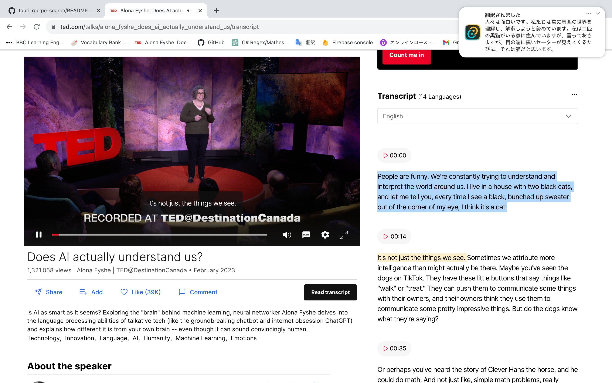

##　翻訳ヘルパー

- クリップボードに保存された文章を自動で翻訳しデスクトップ通知で表示します。
- 日本語、英語、韓国語、中国語をサポートしています。

## スクリーンショット

<p float="left">
  
   
</p>

## 使い方

- 時前準備
  Google Cloud Console にログインし、Cloud Translation API の API キーを取得する必要があります。
  (毎月 500,000 文字は無料で翻訳できるため、個人利用の場合は料金発生の心配はありません)
- アプリ起動時に入手した API キーを入力します。
- 翻訳開始ボタンを押します。
- 翻訳中止するまで、クリップボードに保存された文章、単語を自動翻訳しデスクトップ通知として表示します。

## 使う技術

- Tauri (バックエンド: Rust、フロントエンド: TypeScript)
- React

### 外部ライブラリ

フロント

- tailwindcss
- react-hot-toast

バックエンド

- reqwest
- tokio
- dotenv
- clipboard
- lazy_static

## 学べること

- Rust の非同期処理(task の作成)
- REST API の使用方法 (Google Transition API)

## インストール手順

1. リポジトリをクローンします。
   ```
   git clone https://github.com/taiyou1116/tauri-transition-helper.git
   ```
2. 依存関係をインストールします。
   ```
   yarn
   ```
3. アプリを実行します。
   ```
   yarn tauri dev
   ```
